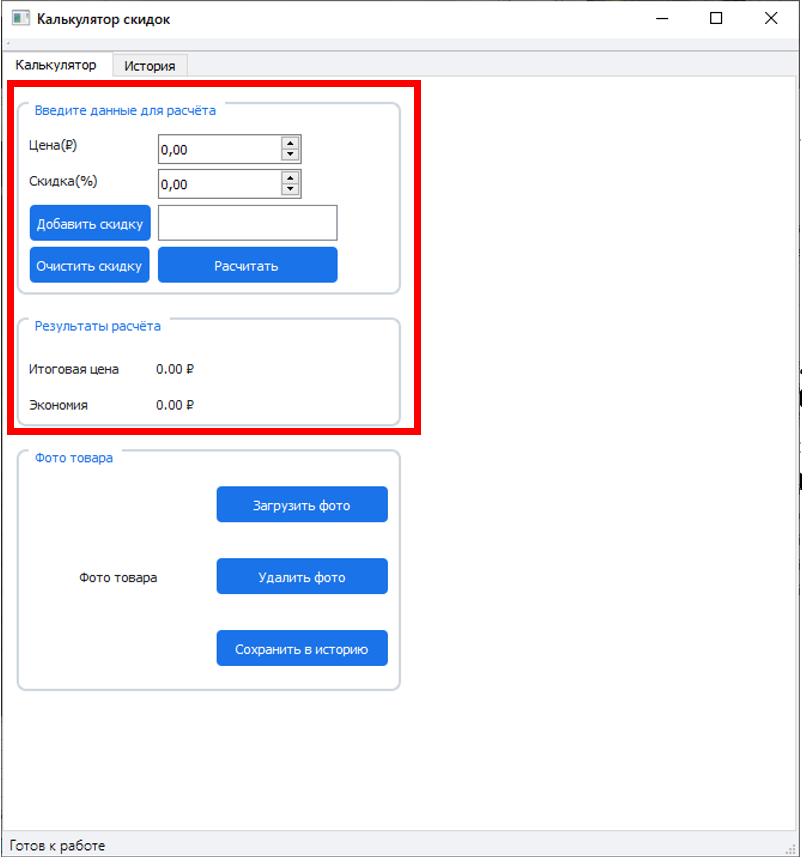
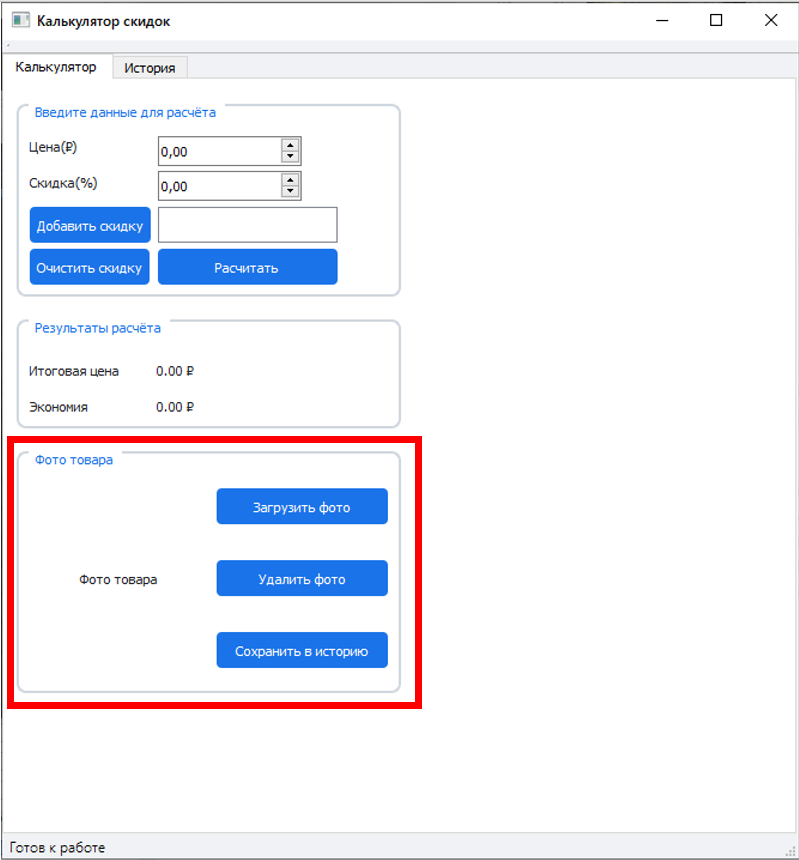
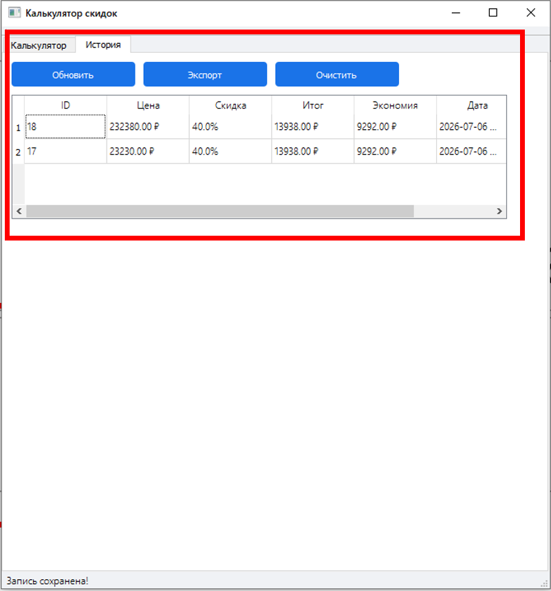

# Калькулятор скидок

Приложение на PyQt5 для расчёта каскадных скидок с сохранением истории в SQLite. Программа позволяет быстро вычислить итоговую цену с учётом одной или нескольких последовательных скидок, сохранить расчёты в историю, добавить фото товара и выгрузить историю в CSV.

---

## Демонстрация

#Вкладка «Калькулятор» с полями ввода цены, скидок, кнопками и результатом.
 

---

#Здесь можно загрузить фото товара
 

---

#Вкладка «История» с таблицей сохранённых расчётов.
  

---

## Установка и запуск
1. Создайте виртуальное окружение: `python -m venv venv`
2. Активируйте:
- Windows: `venv\Scripts\activate`
- macOS/Linux: `source venv/bin/activate`
3. Установите зависимости: `pip install -r requirements.txt`
4. Запустите: `python discount_calculator.py`

---

## Руководство по использованию

### 1. Введите данные
- В поле **«Цена (₽)»** укажите стоимость товара.
- В поле **«Скидка (%)»** введите размер скидки в процентах.
- Если нужно применить несколько скидок (каскад):
  - Введите первую скидку → нажмите **«Добавить скидку»**.
  - Повторите для остальных скидок.
  - Все добавленные скидки отобразятся в списке.

### 2. Выполните расчёт
- Нажмите кнопку **«Рассчитать»**.
- В блоке **«Результаты расчёта»** появятся:
  - **Итоговая цена** — цена после всех скидок.
  - **Экономия** — сколько вы сэкономили.

### 3. Загрузите фото 
- Нажмите **«Загрузить фото»** → выберите изображение на компьютере.
- Фото появится в рамке.
- Чтобы удалить фото — нажмите **«Удалить фото»**.

### 4. Сохраните расчёт в историю
- После выполнения расчёта нажмите **«Сохранить в историю»**.
- Запись (цена, скидка, итог, экономия) будет добавлена в базу данных.

### 5. Просмотр истории
- Перейдите на вкладку **«История»**.
- Нажмите **«Обновить»**, чтобы увидеть все сохранённые записи.
- Таблица показывает: ID, цену, скидку, итог, экономию и дату сохранения.

### 6. Очистка истории
- На вкладке «История» нажмите **«Очистить историю»**.
- Подтвердите действие — все записи будут удалены.

### 7. Экспорт в CSV
- На вкладке «История» нажмите **«Экспорт CSV»**.
- Выберите папку и имя файла → сохранится таблица с историей в формате CSV.
- Если история пуста — программа предупредит об этом.

---

## Структура проекта
Структура проекта

- discount_calculator.py → Точка входа, главное окно, логика приложения
- discount_calculator.ui → Интерфейс, созданный в Qt Designer
- discounts.db → Файл базы данных SQLite (создаётся автоматически)
- requirements.txt → Список зависимостей
- app.log → Лог-файл для отслеживания работы программы
- README.md → Описание проекта
- test_plan.txt → Тест-план
- .gitignore → Исключения для Git

---

## Контакты
Автор: Александра Тинюкова
Группа: ОЗФМ-12-25

---

## Лицензия

Данный проект создан в рамках учебной практики. Код может использоваться в образовательных целях.
